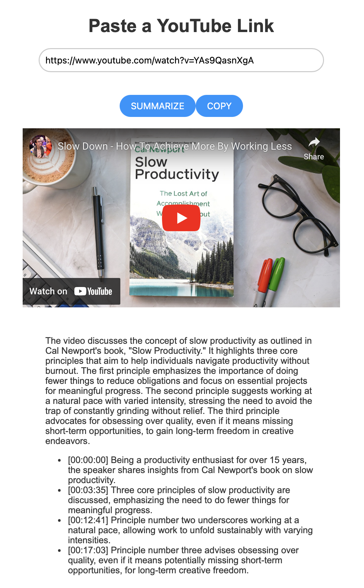

# Youtube Summarizer

A Flask application designed to summarize YouTube videos, providing both a concise summary and key highlights with timestamps. This tool leverages the YouTube Transcript API and OpenAI's GPT-3.5 model to generate summaries.



## Features

- **Video Summarization**: Input a YouTube video URL and receive a summary along with key points and their timestamps.
- **Responsive Design**: A user-friendly interface that works well on both desktop and mobile browsers.
- **Docker Support**: Easily set up and run the application using Docker.

## Getting Started

These instructions will get you a copy of the project up and running on your local machine for development and testing purposes.

### Prerequisites

- Docker
- Docker Compose

### Installation

1. Clone the repository to your local machine:
   ```sh
   git clone https://github.com/yourusername/youtube-summarizer.git
   ```

2. Navigate to the project directory:
    ```python
    cd youtube-summarizer
    ```
3. Create a `.env` file in the project directory and add your OpenAI API key

4. Build and run the Docker containers:
    ```sh
    docker-compose up --build
    ```
The application should now be running and accessible at http://localhost:5000.

### Usage
1. Open your web browser and navigate to http://localhost:5000.
2. Enter a YouTube video URL into the input field.
3. Click the "Summarize" button to receive the video's summary and key highlights.

### Development
To modify the application or contribute to its development:

1. Ensure you have Python 3.10 and pip installed on your local machine.
2. Install the required Python packages:
    ```sh
    pip install -r requirements.txt
    ``` 
3. Run the Flask application locally:
    ```sh
    flask run
    ```
